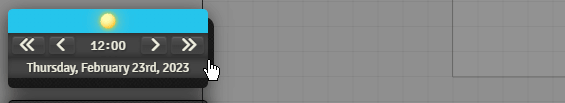
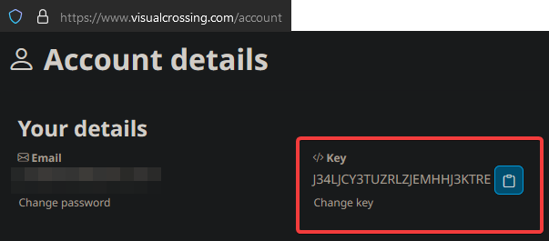
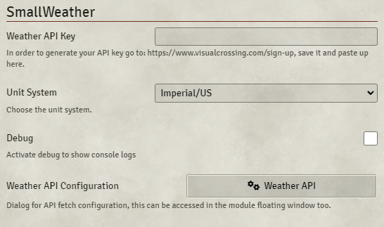
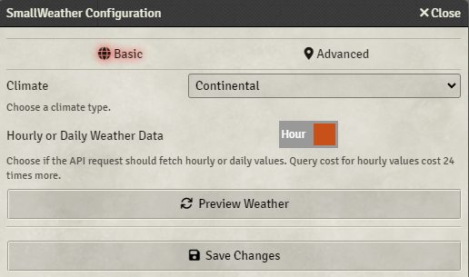
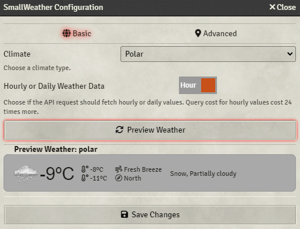
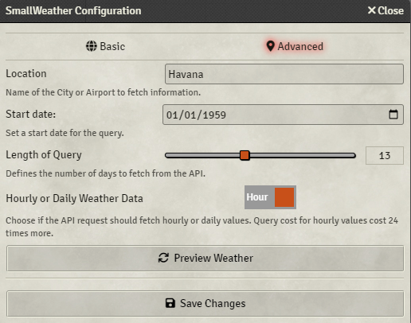
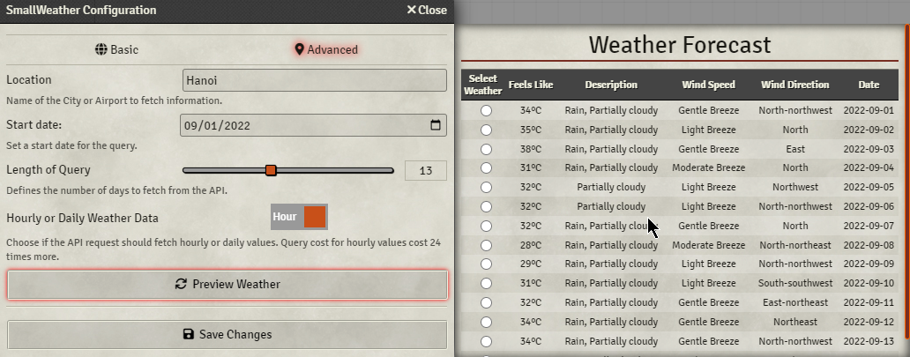

   

  
   
 

# SmallWeather
Most weather generation models for RPGs suffer from conflict between simplicity leading to unrealistic results and complex implementation that requires research. Instead of creating yet another weather simulation, this module uses Mother Nature and online API for real world historical data from any past date (or even the current real world weather) from any place in the world. This mod allows the GM who uses [SmallTime](https://foundryvtt.com/packages/smalltime) to show weather to their players.

## Functions
This module fetches weather data from an online API, shows the current weather adding a drawer to SmallTime app and offer basic or advanced options for the GM. 

## Settings
**Weather API Key**  
*Default: blank*  
SmallWeather uses https://visualcrossing.com API in order to fetch weather data, so you must provide an API key to use the service. The API is free for 1000 queries per day, should be enough for most games. Keep in mind that if you want the module to change the weather hourly, then it will cost 24 queries per day; still enough for most games.  

| | IMPORTANT: The API key is a group of 25 characters that look something like this `J34LJCY3TUZRLZJEMHHJ3KTRE`. You will find this API Key in your Visual-Crossing account details and it will link your account to SmallWeather.  It is NOT the API Link found in the Visual-Crossing Query Builder. |
| :---: | :---- |

**Unit System**  
*Default: Imperial/US*  
You can choose between Imperial or Metric.  

**Debug**  
*Default: unchecked*  
Display console debug messages.  

**Weather API Configuration**  
Before using this setting you must provide the API key and save the game settings. Bellow I explain all the fields available.  

### Basic Configuration
You can simply select a climate type and save changes to start using it.
If you toggle to hourly instead of daily, the weather should change every in-game hour. The climate type will auto sync with your [Simple Calendar](https://foundryvtt.com/packages/foundryvtt-simple-calendar) configured season.

If you hit preview you should see this:

### Advanced Configuration
Here you can manually input a location, a date and a query length to have the data pulled from the API. With the same toggle Daily/Hourly as in the basic configuration.  

If you hit preview, while in the advanced tab, you should see a table with dates you could pick to start to pull weather from:

## Dependencies  
1. [SmallTime](https://foundryvtt.com/packages/smalltime)
2. [Simple Calendar](https://foundryvtt.com/packages/foundryvtt-simple-calendar)

## Known Issues  
- So far none.

## Feedback
If you have suggestions or want to report a problem, you can create an issue here: [Issues](../../issues)

## Changelog
You can read the changelog here: [CHANGELOG.md](/CHANGELOG.md)

## Special Thanks
`Peterson`, `roi007leaf`, comrade `Zhell` for his help as usual and `ApoApostolov` for his great idea!

## Donations
The module is totally free and will remain this way.  
I am unemployed, though. So every little help counts.

## Attributions

